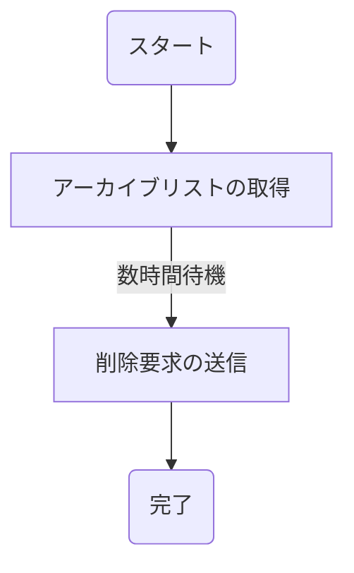

# はじめに
Glacierは良いサービスである。しかし、そのデータを削除するのは非常に面倒なことである。データの削除はAWSマネジメントコンソール上で実施することができず、CLIやAPIを用いた削除要求が必要である。また、データが残っているとボールト(バケットのようなもの)の削除ができない。Glacierからデータを削除するということは実に面倒なことなのである。

手動でCLIコマンドを実行し、削除することも可能ではあった。しかし、今回対象としたボールトはNASのバックアップデータ2.5TB分、アーカイブの個数としては30万を超えるものだったため、Pythonスクリプトを作成し使用した。今回はそのPythonスクリプトの使用方法の紹介を行う。スクリプトの内容の紹介は別で行う。

# データ削除の流れ
データ削除のための手順を以下に示す。

概要を説明すると、AWSに対してボールト内のアーカイブ一覧を要求し、その一覧に基づいてアーカイブの削除を行うような流れになる。ただし、アーカイブ一覧を要求してから実際にDLできるようになるまで数時間かかる。

# データ削除作業
この章では、データ(アーカイブ)削除作業の前提条件や、実際の手順、また、今回の作業内で実際に使用したPythonスクリプトについて説明する。
## 前提条件
以下のものがインストールされていて、正常に動作することを前提とする。
- AWS CLI(ログインが完了していること)
- 何らかの方法でpython3を実行できる環境

## アーカイブ一覧の取得
今回、アーカイブ一覧の取得にはAWS CLIを使用する。AWS CLIを使用してアーカイブ一覧を取得するにあたり以下の情報が必要である。
- ボールト名
- AWSアカウントのID

AWSアカウントのIDは普段意識しない値であるためわからない人も多いと思う。 (実際私もよくわからなかった) そういう人は以下のドキュメントを参照してほしい。

https://docs.aws.amazon.com/ja_jp/accounts/latest/reference/manage-acct-identifiers.html

必要な情報をそろえた上で、以下のコマンドを実行することによってアーカイブ一覧をリクエストすることができる。
```bash
aws glacier initiate-job --vault-name {ボールト名} --account-id {AWSアカウントのID} --job-parameters="{\"Type\":\"inventory-retrieval\"}"
```

実行後、JobIdを含むjsonが表示されるため、JobIdを控えておく。

先述した通り、アーカイブ一覧の取得には長時間かかるため、通知を受け取れるよう設定すると便利である。詳しくは以下を参照のこと。

https://docs.aws.amazon.com/ja_jp/amazonglacier/latest/dev/configuring-notifications.html

### アーカイブ一覧取得処理完了の確認方法
アーカイブ一覧のリクエストコマンド実行後、AWS CLIはすぐに終了してしまうため、リアルタイムに処理中かどうかを知るには下記コマンドを実行する必要がある。
```bash
aws glacier describe-job --vault-name {ボールト名} --account-id {AWSアカウントのID} --job-id {JobId}
```
コマンド実行後下記のような出力になると思われる。**注: 現在は変更されている可能性あり**
```json
{
    "InventoryRetrievalParameters": {
        "Format": "JSON"
    }, 
    "VaultARN": "*** vault arn ***", 
    "Completed": false, 
    "JobId": "*** jobid ***", 
    "Action": "InventoryRetrieval", 
    "CreationDate": "*** job creation date ***", 
    "StatusCode": "InProgress"
}
						
```
完了したかどうかは、StatusCodeを見て判断してほしい、完了したら完了したっぽい表記になるはずである。

## アーカイブ一覧のダウンロード
今回使用するPythonスクリプトは、アーカイブリストのjsonをもとに削除要求を行う。よって、アーカイブ一覧をダウンロードする必要がある。

アーカイブ一覧のダウンロードには以下のコマンドを使用する。
```bash
aws glacier get-job-output --vault-name {ボールト名} --account-id {AWSアカウントのID} --job-id {JobId} output.json
```

コマンド実行後、カレントディレクトリにoutput.jsonが保存されているはずである。アーカイブ数が多い (30万以上など)の場合は間違ってもviなどで開いてはいけない。普通にフリーズする。(一敗)

## アーカイブ削除
今回使用したPythonスクリプトを使用してGlacierからArchiveを削除する方法を説明する。

### リポジトリのクローン
以下のリポジトリをローカルにクローンする

https://github.com/ksatoshi/glacier-deleter

```bash
git clone https://github.com/ksatoshi/glacier-deleter.git
```

### スクリプト実行
まず、すでにインストールされているPython3を使用する場合の手順を紹介する。

**すでにインストールされているpython3を使用する場合**
```bash
# 初期設定
cd glacier-deleter
pip install boto3
python ./main.py

# スクリプト実行後ボールト名、対象リージョン、アーカイブリストが保存されている場所のパスを入力するプロンプトが表示されるため入力する。
vault name>> {ボールト名}
AWS region (default: ap-northeast-1)>> {対象リージョン}
file path>> {アーカイブリストのパス}
```

**mise, uvを使用する場合**
```bash
# 初期設定
cd glacier-deleter
mise trust
mise install
uv sync
uv run main.py

# スクリプト実行後ボールト名、対象リージョン、アーカイブリストが保存されている場所のパスを入力するプロンプトが表示されるため入力する。
vault name>> {ボールト名}
AWS region (default: ap-northeast-1)>> {対象リージョン}
file path>> {アーカイブリストのパス}
```

スクリプト実行中次のように進捗が表示される。表示例)
```bash
# AWSからのレスポンスヘッダー(実際の出力の控えがないため省略)
1/3000
# AWSからのレスポンスヘッダー(実際の出力の控えがないため省略)
2/3000
# ----以下省略----
# AWSからのレスポンスヘッダー(実際の出力の控えがないため省略)
3000/3000
```

スクリプトの終了後、日付が変わった後にAWSマネジメントコンソールを確認すると、アーカイブの数が0または-(ハイフン)になっているはずである。これで晴れてボールトの削除ができ、不要なデータを保存するために使用していた料金を節約できるのである。
# まとめ
今回は、自作のスクリプトを使用したGlacierアーカイブの全削除の方法を紹介した。正直これがベストな方法とは思えないが結果うまくいったので私は満足している。

ちなみに、30万越えのアーカイブ削除にかかった時間であるが、少なくとも24時間を超えている。削除処理はすべてEC2上で行ったが24時間以上SSHのコネクションをキープするEC2の信頼性には脱帽である。

最後に、削除前のアーカイブ数のスクショが出てきたのでそれで締めたいと思う。
